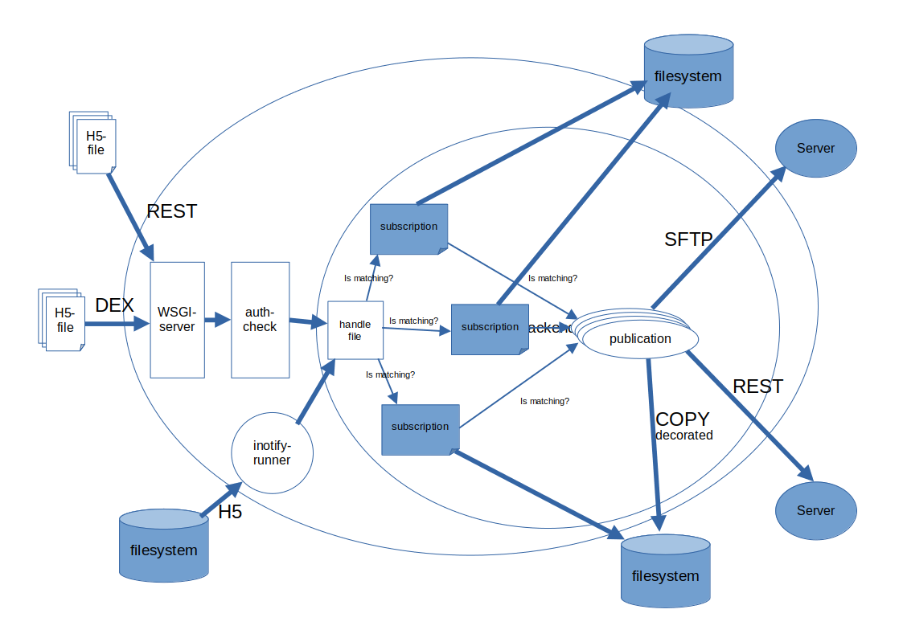

"""""""""""""""""
baltrad-exchange
"""""""""""""""""

---------------------------------------------
A multipurpose exchange engine for radar data
---------------------------------------------

Introduction
=================

The baltrad-exchange engine is a new modernized approach of allowing exchange of radar data. Currently, 
the only supported format is ODIM-H5 but the allowed formats is possible to extend in the future.
There are several reasons for why this engine was created but to name a few key-points:

- Add more flexible routing that can route on meta-information in a file
- Possibility to distribute monitored files as well as received files
- Smaller (and easier) installation footprint that doesn't require an external database
- More flexible and easier configuration
- Possibility to run several different instances on same server
- Allow possibility to decorate a file before it is sent to a subscriber

=================
Overview
=================

  
The exchange of any files can be divided into a number of different steps.
   
**Input**
  First, there is the source file that should be distributed. This file should be injected into the system some how. Either waiting for input like when receiving a file or some sort of monitoring/triggering like polling or event handling.

**Authentication**
  When a file is inserted into the system actively we must have some sort of authenticating that it is a valid origin. The baltrad-exchange is using public/private keys and signature handling to ensure that this is taken care of in a secure way.

**Subscriptions**
  When the file has passed the authentication part it is time to decide what to do with the incomming file.
  - First, the origin (nodename / id) of the file is verified against the subscription to know that we are expecting something from that origin.   
  - Next the metadata is extracted from the file and matched against the subscription filter to know if this subscription should handle the file
  - If both of above checks has passed. Then the incomming file is stored at zero or more storages before it is published to all publications that matches the file metadata
  - It is also possible to put the file on a processor queue if the above checks has passed if further processing should be done within the scope of the exchange mechanism

**Publications**
  Since different parties want to have files distributed in various ways the publication has been divided into three different parts. The publisher, the connector and the sender.
  
  - **publisher** is the overall spider taking care of threads, what connector to use and if the outgoing file should be modified in any way. Currently there is only one publisher, the standard_publisher.
  - **connection** this is the approach to use when distributing the file. For example if the file should be sent with some sort of failover, duplication, ...
  - **sender** is the actual protocol to use when sending the file, like to another node, a dex-node or some sort of sftp, scp-protocol

**Runners**
  If a file isn't injected into the system we need to be able to get the file into the system some other way and here is where the runners comes into action. A runner is a separate entity that
  uses the server backend to trigger and pass a file into the system like if it had passed the **Authentication** part. The runners can for example be event triggered variants like inotify. It can also be
  triggered variants that accepts some external trigger or scheduled variants.

========================
Authorization
========================

There are several different ways to ensure that the sender and receiver knows about each other and in this software we have used basic signature handling. That is, you as a sender signs a message
using your private key and the receiver verifies the sent data using the senders public key. Hence, each installation of a node needs to have at least one private/public-key. The private key should be
kept at a safe place with read-only permissions for the user that is running the system. Typically 600 or possibly 660 if the group should be trusted as well.

Since we have to be backward compatible with earlier DEX-variants we have at this time added two different ways to handle private/public keys. The standard solution is to use the internal crypto
handling which is just called **crypto** in the configuration. The other variant is named **keyczar** since DEX signatures is based on that implementation. 

To create the keypair it is just to type

.. code-block:: shell-session
  
  %> baltrad-exchange-config create_keys --type=crypto --nodename=myserver
  Created: 
    Private key: ./myserver.private
    Public  key: ./myserver.public
    Public json: ./myserver_public.json

As you see in the example, three files will be created. A private key in PEM-format which is to be kept safe and two different public keys. One in PEM format and the other in json format. 
The one in json format will typically be used when setting up the subscriptions. The json-file contains some meta information and the public PEM-key with newlines escaped to be compatible
with json. !!!NOTE!!! It might be reasonable to also have configured a folder containing all the keys!!!

========================
Configuration
========================
The basic configuration is just a property-file containing the most basic information which is specified when starting the server. In order for the system to start you won't need any
json configuration but without them the system won't do anything.

.. code-block:: cfg

  # This is the local address the WSGI server will be listening on
  baltrad.exchange.uri=https://localhost:8089
  
  # How logging should be performed
  baltrad.exchange.log.type=logfile
  
  # The log id used
  baltrad.exchange.log.id=baltrad-exchange
  
  # This is the configuration for the WSGI-server with number of threads, number of waiting messages in backlog and the operation timeout 
  baltrad.exchange.threads=20
  baltrad.exchange.backlog=10
  baltrad.exchange.timeout=10

  # Name of this server. Will be used when communicating with other nodes
  baltrad.exchange.node.name = example-server

  # Add keyczar to providers if wanted
  baltrad.exchange.auth.providers = noauth, crypto

  # Default crypto-variant
  baltrad.exchange.auth.crypto.root = /etc/baltrad/exchange/crypto-keys
  baltrad.exchange.auth.crypto.private.key = /etc/baltrad/exchange/crypto-keys/example-server.private

  # If keyczar is in providers. Uncomment and create/import the keyczar private key
  # baltrad.exchange.auth.keyczar.keystore_root = /etc/baltrad/bltnode-keys
  # baltrad.exchange.auth.keyczar.private.key = /etc/baltrad/bltnode-keys/anders-nzxt.priv

  # Comma separated list of directories where json config files are located.
  baltrad.exchange.server.config.dirs = /etc/baltrad/exchange/config

  # Where the odim source file can be found in rave format.
  baltrad.exchange.server.odim_source = /etc/baltrad/rave/config/odim_source.xml

  # The database in where some basic data is stored when performing the source-lookup
  baltrad.exchange.server.source_db_uri = sqlite:///var/cache/baltrad/exchange/source.db

  # Note, these should only be readable by the baltrad user
  # and can be created using the following command.
  # openssl req  -nodes -new -x509  -keyout server.key -out server.cert
  baltrad.exchange.server.certificate = /etc/baltrad/exchange/etc/server.cert
  baltrad.exchange.server.key = /etc/baltrad/exchange/etc/server.key

During startup all config.dirs will be traversed and all files ending with **.json** will be processed and possibly parsed. Each json-file should be defined like

.. code-block:: json

  {"<keyword>":{
    }
  }
  
Where the <keyword> is one of the following types:

- **subscription**
- **storage**
- **publication**
- **runner**
- **processor** 

Whenever a json file is read and the backend identifies one of the above keywords the object is created to support that configuration. Each of these keyword configurations will
be explained later on

============================
Subscriptions (subscription)
============================

A subscription defines what should be allowed into the system and the basic operations that should be performed on the data that arrives. A subscription contains the following parts:

**storage**
  A list of zero or more named storages
  
**filter**
  A filter "bdb-style" that is used to match the files metadata to decide if this subscription is interested in the incomming file or not.
  
**allowed-ids**
  A list of allowed ids that identifies the origin. This will automatically be extended with the nodenames of the allowed nodes. It can also be identifying a runner and other internal ids.
  
**cryptos**
  This actually defines an origin that is using the REST-protocol by defining the crypto used by that origin. All cryptos will be registered in the authentication manager and when a file arrives
  the signature will be validated in the auth-check before the file is handled.

The subscription will however not decide where a file should be published or if it should be processed. Instead all files that passes the filter and allowed-ids check will first be distributed to
the publishers and then to the processors. If it is nessecary to distribute/publish a file directly it can be done by implementing a distributed storage that handles this. Keep in mind that this 
will require some threading and other considerations since the subscription handling should not be allowed to block waiting for time consuming operations since it will starve the WSGI-servers thread 
pool.

.. code-block:: json

  {
    "subscription":{
    "active":true,
    "storage":["default_storage"],
    "filter":{
      "filter_type": "and_filter", 
      "value": [
        { "filter_type": "attribute_filter", 
          "name": "_bdb/source_name", 
          "operation": "in", 
          "value_type": "string", 
          "value": ["sehem","seang", "sella"]
        }, 
        { "filter_type": "attribute_filter", 
          "name": "/what/object", 
          "operation": "in", 
          "value_type": "string", 
          "value": ["SCAN","PVOL"]
        }
      ]
    },
    "allowed_ids":["anders-other"],
    "cryptos":[
      {
        "auth":"keyczar",
        "conf":{
          "nodename": "anders-nzxt",
          "pubkey":"/opt/baltrad2/etc/bltnode-keys/anders-nzxt.pub"
        }
      },
      {
        "auth":"crypto",
        "conf":{
          "nodename": "anders-silent", 
          "creator": "baltrad.exchange.crypto", 
          "key": "-----BEGIN PUBLIC KEY-----\nMIID<.....full public key in PEM format.....>==\n-----END PUBLIC KEY-----",
          "_comment_":"Instead of using 'key', it is possible to specify a file. If the pubkey is not pointing to an absolute path it will be using the keystore roots as well",
          "pubkey":"anders-silent.public", 
          "keyType": "dsa", 
          "type": "public"
        }
      }	  	
    ]}
  }

The subscription contains two very important parts. First the filter, this will ensure that only files that are of interest will be managed. The filter syntax is currently according to
the baltrad-db query syntax and hence the "_bdb/" identifier is used for internal metadata. The second part if a combination of allowed_ids and cryptos. When system is starting up, all 
cryptos in all subscriptions are processed and registered in the authentication manager together with the nodename. The node names are added to the list of allowed_ids each subscription has. 
Then only files sent from an id that is in list of allowed ids will be allowed.

Currently, the only allowed cryptos are keyczar (for DEX-compatibility) and the internally used crypto which is just using plain public/key-signature handling.

As can be seen in the above example, there is a storage named "default_storage" that this subscription expects the files to be stored in. 

========================
Storages (storage)
========================
The storages are locations where files should be placed and are referred to by the subscriptions. Typically you would only have a few different storages. For example on the file system, in a database or in an archive.
 
.. code-block:: json

  {
    "storage": {
      "class":"baltrad.exchange.storage.storages.file_storage",
      "name":"default_storage",
      "arguments": {
        "structure":[
          {"object":"SCAN",
           "path":"/tmp/baltrad_bdb",
           "name_pattern":"${_baltrad/datetime_l:15:%Y/%m/%d/%H/%M}/${_baltrad/source:NOD}_${/what/object}.tolower()_${/what/date}T${/what/time}Z_${/dataset1/where/elangle}.h5"
          },
          {"path":"/tmp/baltrad_bdb",
           "name_pattern":"${_baltrad/datetime_l:15:%Y/%m/%d/%H/%M}/${_baltrad/source:NOD}_${/what/object}.tolower()_${/what/date}T${/what/time}Z.h5"
          }
        ]
      }
    }
  }

The above storage-mechanism (baltrad.exchange.storage.storages.file_storage) is probably the one that is going to be used the most. It gives the user a possibility differentiate 
between what/object types and store them with different names in different places. This storage-class also provides the chance of using metadata naming which is quite powerful
when saving the files.

Naming
------

The metadata namer is a separate class that can be used when a string should be created from the metadata. The ${..} is used as a placeholder for an ODIM H5 metadata attribute to retrive the value of the metadata attribute. 
For example ${/what/object} will give SCAN/PVOL/.. Then there are a few unique placeholder variables that doesn't exist in the metadata of a ODIM H5 file but are very useful.

**_baltrad/source:<ID>**
  Since what/source can be incomplete, this will return the specific <ID> after the source has been identified. E.g. _baltrad/source:WMO, _baltrad/source:NOD. If source not could be identified, "undefined" is returned.

**_baltrad/source_name**
  Since what/source can be incomplete, this will return the name of the source after the source has been identified. Typically it is the NOD. If source not could be identified, "undefined" is returned.

**what/source:<ID>**
  Grabs the <ID> directly from what/source and returns it. Note, if source is incomplete this will return "undefined"
  
**/what/source:<ID>**
  Grabs the <ID> directly from /what/source and returns it. Note, if source is incomplete this will return "undefined"
  
**_baltrad/datetime(:[A-Za-z0-9\\-/: _%]+)?**
  For creating datetime strings from the what/date + what/time. The dateformat is same as provided in the datetime class. For example if you want to specify a date
  as 2022/11/03/12/04, the you use the following description *${_baltrad/datetime:%Y/%m/%d/%H/%M}*.

**_baltrad/datetime_u:([0-9]{2})(:[A-Za-z0-9\\-/: _%]+)?**
  In some cases you might want to have minute-intervals. For example a directory structure where you want all files between minute 1-15 to be placed in a folder with 15 as minutes. This
  can be achieved by specifying *${_baltrad/datetime_u:15:%Y/%m/%d/%H/%M}* and the folders will have a minute part that is either 00,15,30 or 45. This function will also wrap so that if
  what/time has minutes between for example 46-60, then these will be placed in next hours 00-minute folder.
  
**_baltrad/datetime_l:([0-9]{2})(:[A-Za-z0-9\\-/: _%]+)?**
  This placeholder almost behaves like _baltrad/datetime_u with the exception that it will lower the minute interval instead. This means that all files within minute 0-15 will be put in 00, between
  15-30 in 15 and so on. Syntax is almost identical *${_baltrad/datetime_l:15:%Y/%m/%d/%H/%M}*

The naming functionality also provides something that can be called suboperations which allows the manipulation of the values that are returned by the placeholders. 
These are used directly on the placeholder. For example *${what/source:CMT}.tolower()*. They can also be chained like *${what/source:CMT}.tolower().toupper(1)*.

Currently the supported suboperations are:

**tolower([beginIndex[,endIndex]])**
  changes the string to lower case. If beginIndex is specified the string gets lower case after specified beginIndex until end or endIndex if specified.

**toupper([beginIndex[,endIndex]])**
  changes the string to upper case. If beginIndex is specified the string gets upper case after specified beginIndex until end or endIndex if specified.

**substring(beginIndex[,endIndex])**
  returns a substring from beginIndex to end or endIndex if specified.

**replace(matchstr, replacementstr)**
  replaces all occurances of matchstr with replacementstr
  
**trim()**
  Trims both left and right side of the string from any white spaces.
  
**ltrim()**
  Trims the left side of the string from any white spaces.
  
**rtrim()**
  Trims the right side of the string from any white spaces.
  
**interval_u(interval[,limit])**
  ** Do not use, under development**
  
**interval_l(interval)**
  ** Do not use, under development**

With the above knowledge, assuming that a scan with elevation angle=0.5 arrives from sella, with /what/date=20221103 and /what/time=220315 then the following
expression *${_baltrad/datetime_l:15:%Y/%m/%d/%H/%M}/${_bdb/source:NOD}_${/what/object}.tolower()_${/what/date}T${/what/time}Z_${/dataset1/where/elangle}.h5*
will result in *2022/11/03/22/00/sella_scan_202211032203_0.5.h5*.

==========================
Publications (publication)
==========================

Whenever a subscription has approved an incoming file, this file will be posted to all publications which in turn will have to decide if the file should be
distributed or not depending on the file content. Obviously, this might cause some problems if not configuring the system properly since if more than one
subscription approves the same file, then this file might be sent twice. In the same way, if a publication filter is to generic files might be sent more than once.

  

